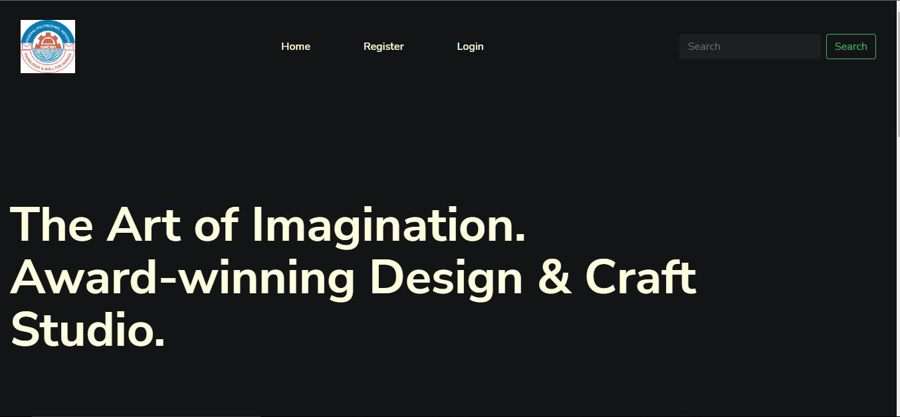

#   Art Galary

### The aim of this project work is to develop an online exhibition and portfolio management system. This will be achieved using the following set of objectives: 
1.	The system will provide a platform where student can post their work online for evaluation, comment, and recommendation.
2.	The system will provide a proper backup of student and professional designs for easy access.
3.	The system will provide quick access to the search of a related piece of work.

